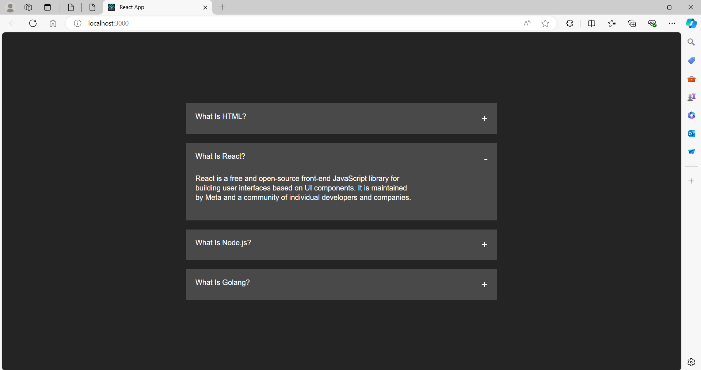

# Accordion App

A dynamic and user-friendly Accordion application built with React to display expandable and collapsible content sections.

## Features

- Expand and collapse sections
- Smooth transition animations
- Responsive design

## Usage

- **Expand a section:** Click on a '+' button in the section header to expand and view its content.
- **Collapse a section:** Click on the expanded section header to collapse and hide its content.


## ScreenShots



## Installation

To run this project locally, follow these steps:

1. **Clone the repository:**

    ```sh
    git clone https://github.com/Sri-Sakthi-CB.git
    cd accordion-app
    ```

2. **Install dependencies:**

    ```sh
    npm install
    ```

3. **Start the development server:**

    ```sh
    npm start

    This will start the app and open it in your default web browser. If it doesn't, you can manually open [http://localhost:3000](http://localhost:3000) in your browser.