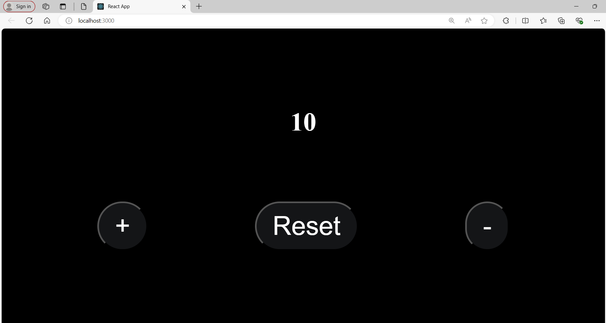

# Counter App using React

## Overview

This project is a simple counter application built with React. It demonstrates the use of React hooks, particularly `useState`, to manage state in a functional component. The app includes features to increment, decrement, and reset the counter. This project aims to provide a clear example of state management in React using the `useState` hook.

## Features

- **Increment**: Increase the counter value by 1.
- **Decrement**: Decrease the counter value by 1.
- **Reset**: Reset the counter value to 0.

## Usage

- Click the `+` button to increment the counter.
- Click the `-` button to decrement the counter.
- Click the `Reset` button to reset the counter to zero.

## How It Works

1. **State Management**: The state of the counter is managed using the `useState` hook, which takes care of the count management.
2. **Event-Handler Functions**: The respective functions updates the state based on the action type (`increment`, `decrement`, `reset`).
3. **Component Rendering**: The component renders the current count and three buttons. 

### ScreenShot

