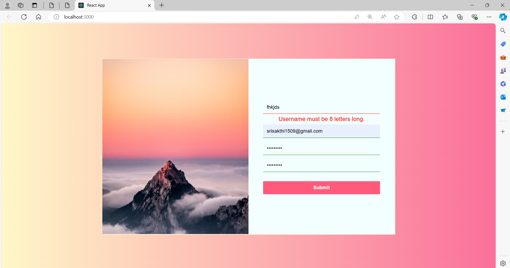
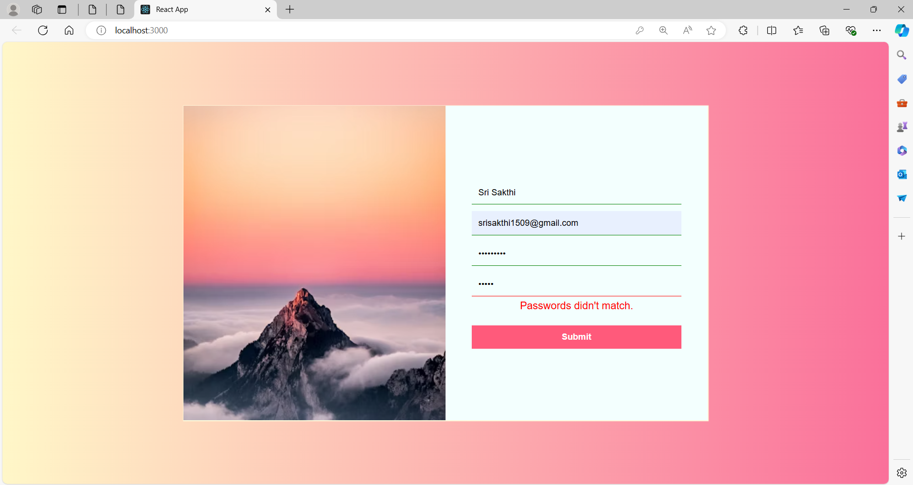
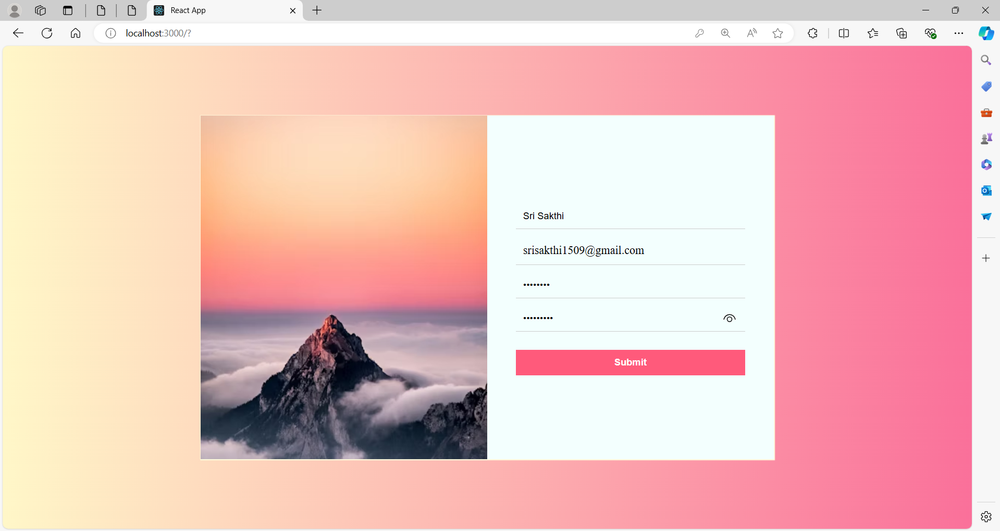

# User Login Validation App

A user-friendly application built with React to validate user inputs for Username, Email, Password, and Confirm Password fields.

## Features

- Username validation
- Email validation
- Password strength validation
- Password match validation
- Responsive design

## Usage

- **Enter Username:** Type your desired username in the input field.
- **Enter Email:** Type your email address in the input field.
- **Enter Password:** Type a strong password in the input field.
- **Confirm Password:** Retype your password to confirm it.
- **Validation Feedback:** Real-time validation feedback will be provided as you click the "Submit" button.

## ScreenShots











## Installation

To run this project locally, follow these steps:

1. **Clone the repository:**

    ```sh
    git clone https://github.com/Sri-Sakthi-CB.git
    cd form-validation-app
    ```

2. **Install dependencies:**

    ```sh
    npm install
    ```

3. **Start the development server:**

    ```sh
    npm start
    ```

    This will start the app and open it in your default web browser. If it doesn't, you can manually open [http://localhost:3000](http://localhost:3000) in your browser.
