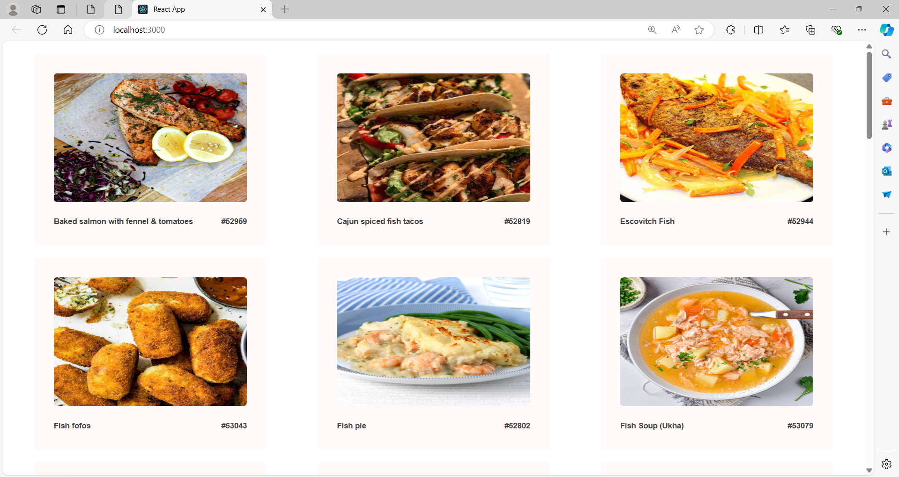

# Meal API Project

A simple and intuitive Meal API application built with React and Axios to help you get various meals and their names with images.

## Features

- List of large variety of meals
- various meals are listed with images and their names.
- View detailed information about each meal
- Responsive design and hover effect

## Usage

- **Fetch using Axios:** Various types of meals and their names are fetched using the API and axios are used for easy fetching and handling error.
- **Browse meals:** Open the application to see a list of meals.
- **View meal details:** Click on a meal from the list to see its detailed information.

## ScreenShots



## Installation

To run this project locally, follow these steps:

1. **Clone the repository:**

    ```sh
    git clone https://github.com/Sri-Sakthi-CB.git
    cd meal-api-project
    ```

2. **Install dependencies:**

    ```sh
    npm install
    ```

3. **Start the development server:**

    ```sh
    npm start
    ```

    This will start the app and open it in your default web browser. If it doesn't, you can manually open [http://localhost:3000](http://localhost:3000) in your browser.
