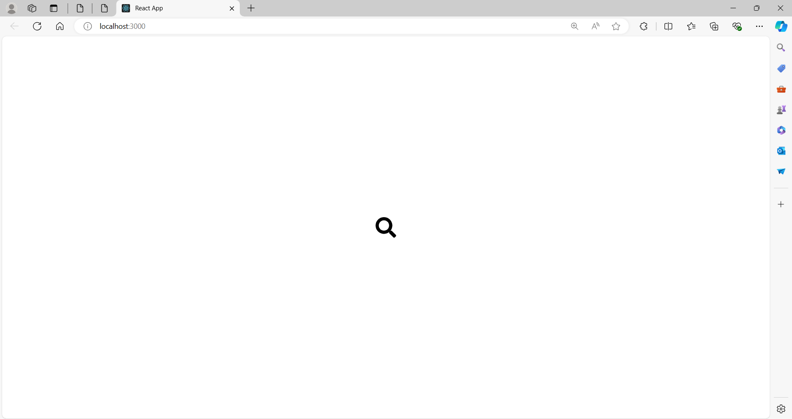
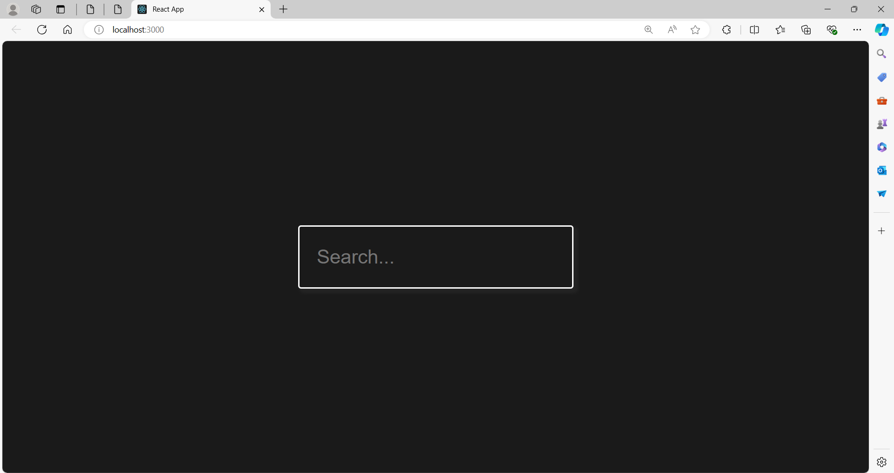

# Search Bar Toggle

A simple and intuitive application built with React that displays a search bar when clicking on a magnifying glass icon.

## Features

- Toggle search bar visibility
- Responsive design

## Usage

- **Toggle search bar:** Click the magnifying glass icon to show or hide the search bar.

## ScreenShots

### Search Bar Hidden


### Search Bar Visible


## Installation

To run this project locally, follow these steps:

1. **Clone the repository:**

    ```sh
    git clone https://github.com/Sri-Sakthi-CB.git
    cd search-bar-appearance
    ```

2. **Install dependencies:**

    ```sh
    npm install
    ```

3. **Start the development server:**

    ```sh
    npm start
    ```

    This will start the app and open it in your default web browser. If it doesn't, you can manually open [http://localhost:3000](http://localhost:3000) in your browser.
