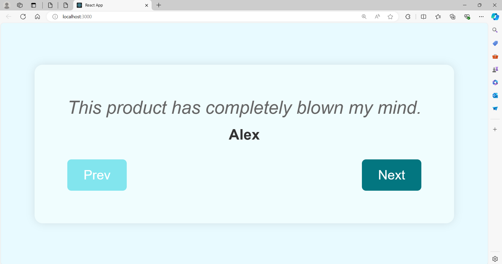

# Testimonials Project

A simple and elegant Testimonials application built with React to showcase user feedback and reviews.

## Features

- Display multiple testimonials
- Responsive design
- Testimonial Navigation using buttons

## Usage

- **Navigate testimonials:** Use the navigation buttons Prev and Next to move through the testimonials.

## ScreenShots

### Testimonials View



## Installation

To run this project locally, follow these steps:

1. **Clone the repository:**

    ```sh
    git clone https://github.com/Sri-Sakthi-CB.git
    cd testimonials-app
    ```

2. **Install dependencies:**

    ```sh
    npm install
    ```

3. **Start the development server:**

    ```sh
    npm start
    ```

    This will start the app and open it in your default web browser. If it doesn't, you can manually open [http://localhost:3000](http://localhost:3000) in your browser.
