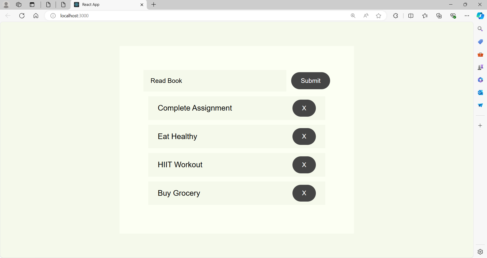

# Todo List App

A simple and intuitive Todo List application built with React to help you manage your tasks efficiently.


## Features

- Add new tasks
- Delete tasks
- Responsive design

## Usage

- **Add a task:** Type your task in the input field and press Enter or click the "Submit" button.
- **Delete a task:** Click the "X" button next to a task to remove it.

## ScreenShots



## Installation

To run this project locally, follow these steps:

1. **Clone the repository:**

    ```sh
    git clone https://github.com/Sri-Sakthi-CB.git
    cd "ToDo List"
    ```

2. **Install dependencies:**

    ```sh
    npm install
    ```

3. **Start the development server:**

    ```sh
    npm start
    ```

    This will start the app and open it in your default web browser. If it doesn't, you can manually open [http://localhost:3000](http://localhost:3000) in your browser.


