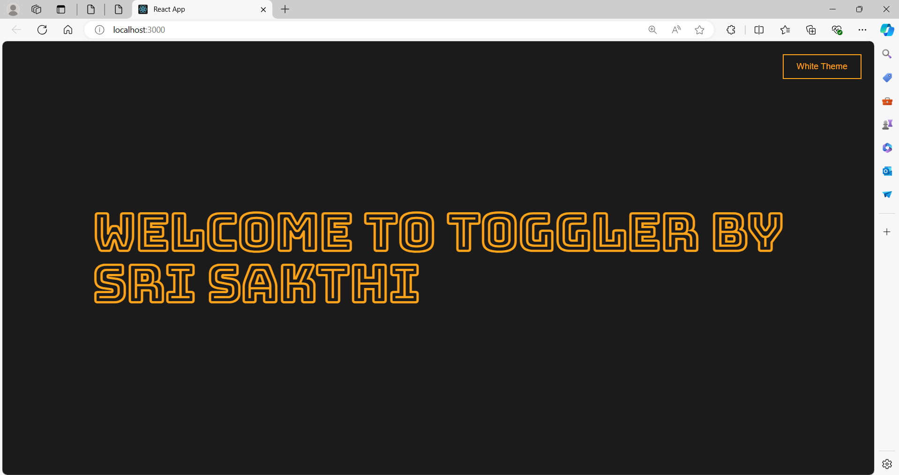

# Themed Application

A simple and intuitive application built with React, featuring both light and dark themes for an enhanced user experience.

## Features

- Toggle between light and dark themes
- Responsive design

## Usage

- **Toggle theme:** Click the "Theme" button to switch between light and dark themes.

## ScreenShots

### Light Theme


### Dark Theme



## Installation

To run this project locally, follow these steps:

1. **Clone the repository:**

    ```sh
    git clone https://github.com/Sri-Sakthi-CB.git
    cd 'Toggler App'
    ```

2. **Install dependencies:**

    ```sh
    npm install
    ```

3. **Start the development server:**

    ```sh
    npm start
    ```

    This will start the app and open it in your default web browser. If it doesn't, you can manually open [http://localhost:3000](http://localhost:3000) in your browser.


