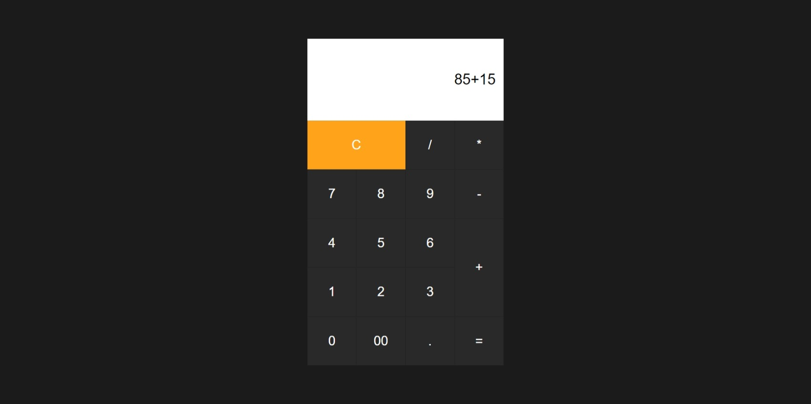
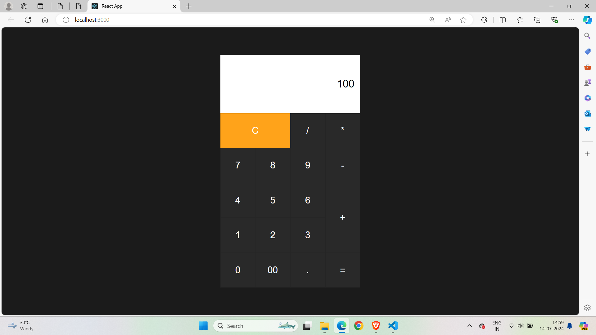

# Calculator App

A simple and intuitive Calculator application built with React to perform basic arithmetic operations.

## Features

- Addition
- Subtraction
- Multiplication
- Division
- Responsive design

## Usage

- **Perform a calculation:** Click the number buttons and operation buttons to enter a calculation. Click the "=" button to see the result.
- **Clear the input:** Click the "C" button to clear the current input and start a new calculation.

## ScreenShots






## Installation

To run this project locally, follow these steps:

1. **Clone the repository:**

    ```sh
    git clone https://github.com/Sri-Sakthi-CB.git
    cd calculator-app
    ```

2. **Install dependencies:**

    ```sh
    npm install
    ```

3. **Start the development server:**

    ```sh
    npm start
    ```

    This will start the app and open it in your default web browser. If it doesn't, you can manually open [http://localhost:3000](http://localhost:3000) in your browser.
